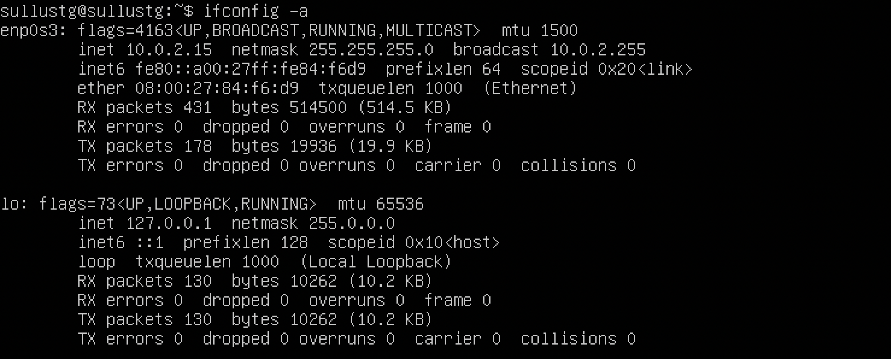
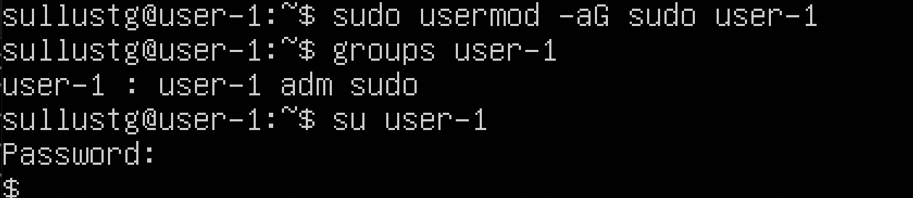
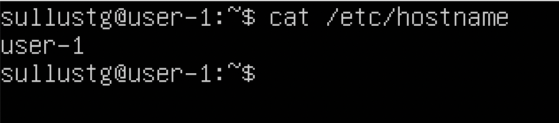
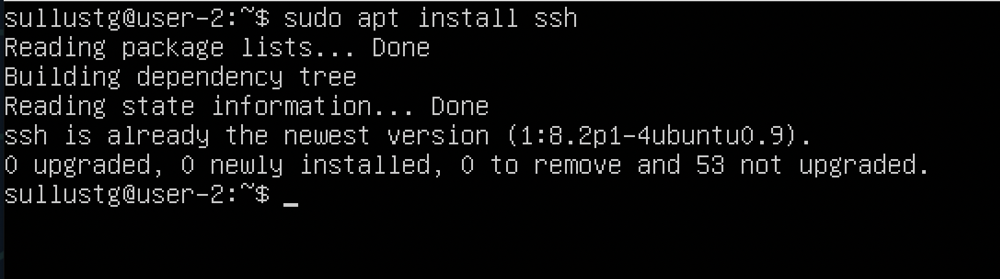

# Linux Network

1. [Инструмент ipcalc](#1-инструмент-ipcalc) \
    1.1. [Сети и маски](#11-сети-и-маски) \
    1.2. [localhost](#12-localhost) \
    1.3. [Диапазоны и сегменты сетей](#13-диапазоны-и-сегменты-сетей)
2. [Статическая маршрутизация между двумя машинами](#2-статическая-маршрутизация-между-двумя-машинами) \
    2.1. [Добавление статического маршрута вручную](#21-добавление-статического-маршрута-вручную) \
    2.2. [Добавление статического маршрута с сохранением](#22-добавление-статического-маршрута-с-сохранением)
3. [Утилита iperf3](#3-утилита-iperf3) \
    3.1. [Скорость соединения](#31-скорость-соединения) \
    3.2. [Утилита iperf3](#32-утилита-iperf3)
4. [Сетевой экран](#4-сетевой-экран) \
    4.1. [Утилита iptables](#41-утилита-iptables) \
    4.2. [Утилита nmap](#42-утилита-nmap)
5. [Статическая маршрутизация сети](#5-статическая-маршрутизация-сети) \
    5.1. [Настройка адресов машин](#51-настройка-адресов-машин) \
    5.2 [Включение переадресации IP-адресов](#52-включение-переадресации-ip-адресов) \
    5.3 [Установка маршрута по-умолчанию](#53-установка-маршрута-по-умолчанию) \
    5.4. [Добавление статических маршрутов](#54-добавление-статических-маршрутов) \
    5.5. [Построение списка маршрутизаторов](#55-построение-списка-маршрутизаторов) \
    5.6. [Использование протокола ICMP при маршрутизации](#56-использование-протокола-icmp-при-маршрутизации)
6. [Динамическая настройка IP с помощью DHCP](#6-динамическая-настройка-ip-с-помощью-dhcp)
7. [NAT](#7-nat)
8. [Знакомство с SSH Tunnels](#8-знакомство-с-ssh-tunnels)

## 1. [Инструмент ipcalc](#1-инструмент-ipcalc)

- Для начала установим сам инструмент

``` shell
$ sudo apt install ipcalc
```

### 1.1. [Сети и маски](#11-сети-и-маски)

1. Адрес сети 192.167.38.54/13

``` shell
$ ipcalc 192.167.38.54/13 | grep Network
```


2. Перевод маски 255.255.255.0 в префиксную и двоичную запись, /15 в обычную и двоичную, 11111111.11111111.11111111.11110000 в обычную и префиксную.

``` shell
$ ipcalc 255.255.255.0 | grep Netmask
```


> /15 в обычную и двоичную

``` shell
$ ipcalc 0.0.0.0/15 | grep Netmask
```


> 11111111.11111111.11111111.11110000 в обычную и префиксную

``` shell
$ ipcalc 0.0.0.0/28 | grep Netmask
```


3. Минимальный и максимальный хост в сети 12.167.38.4 при масках: /8, 11111111.11111111.00000000.00000000, 255.255.254.0 и /4

> Минимальный и максимальный хост в сети 12.167.38.4 при маске /8

``` shell
$ ipcalc 12.167.38.4/8
```


> Минимальный и максимальный хост в сети 12.167.38.4 при маске 11111111.11111111.00000000.00000000

``` shell
$ ipcalc 12.167.38.4/16
```



> Минимальный и максимальный хост в сети 12.167.38.4 при маске 255.255.254.0

``` shell
$ ipcalc 12.167.38.4/23
```


> Минимальный и максимальный хост в сети 12.167.38.4 при маске /4

``` shell
$ ipcalc 12.167.38.4/4
```


### 1.2. [localhost](#12-localhost)

1. Определить и записать в отчёт, можно ли обратиться к приложению, работающему на localhost, со следующими IP: 194.34.23.100, 127.0.0.2, 127.1.0.1, 128.0.0.1

> * Можно:      
```
127.1.0.1;    
128.0.0.1. 
```
> * Нельзя:          
```
194.34.23.100;           
128.0.0.1.
```

### 1.3. [Диапазоны и сегменты сетей](#13-диапазоны-и-сегменты-сетей)
1) Какие из перечисленных IP можно использовать в качестве публичного, а какие только в качестве частных: 10.0.0.45, 134.43.0.2, 192.168.4.2, 172.20.250.4, 172.0.2.1, 192.172.0.1, 172.68.0.2, 172.16.255.255, 10.10.10.10, 192.169.168.1

> * В качестве публичного: 
``` 
134.43.0.2; 
172.0.2.1;
192.172.0.1;
172.68.0.2;
192.169.168.1.
```
> * В качестве чаcтных: 
```
10.0.0.45;
192.168.4.2;
172.20.250.4;
172.16.255.255;
10.10.10.10.
```

2) Какие из перечисленных IP адресов шлюза возможны у сети 10.10.0.0/18: 10.0.0.1, 10.10.0.2, 10.10.10.10, 10.10.100.1, 10.10.1.255

> * Возможны: 
```
10.10.0.2;
10.10.10.10;
10.10.1.255.
```
> * Невозможны:
```
10.0.0.1;
10.10.100.1.
```


## 2. [Статическая маршрутизация между двумя машинами](#2-статическая-маршрутизация-между-двумя-машинами)

> Поднимем две виртуальные машины (далее -- `ws1` и `ws2`) \
> С помощью команды `ip a` посмотрим существующие сетевые интерфейсы


``` shell
$ ifconfig -a
```

1. `lo` или `local loopback` (локальная петля). Служит для подключения по сети к этому же компьютеру и не требует дополнительной настройки;

```
* ws1: 127.0.0.1/8;
* ws2: 127.0.0.1/8.
```

2. `enp0s3` - первый сетевой адаптер работающий в NAT режиме.

```
* ws1: 10.0.2.15/24;
* ws2: 10.0.2.15/24.
```

> Описать сетевой интерфейс, соответствующий внутренней сети, на обеих машинах и задать следующие адреса и маски:

```
* ws1 - 192.168.100.10, маска /16,
* ws2 - 172.24.116.8, маска /12.         
```

``` shell
$ sudo vim /etc/netplan/00-installer-config.yaml
```

> Выполнить команду `netplan apply` для перезапуска сервиса сети

``` shell
$ sudo netplan apply
```


### 2.1. [Добавление статического маршрута вручную](#21-добавление-статического-маршрута-вручную)

> Добавить статический маршрут от одной машины до другой и обратно при помощи команды вида `ip r add`

`ws1`
``` shell
$ sudo ip r add 172.24.116.8 dev enp0s3
```

`ws2`
``` shell
$ sudo ip r add 192.168.100.10 dev enp0s3
```

> Пропинговать соединение между машинами.

`ws1`
``` shell
$ sudo ping -c 172.24.116.8
```

`ws2`
``` shell
$ sudo ping -c 192.168.100.10
```


### 2.2. [Добавление статического маршрута с сохранением](#22-добавление-статического-маршрута-с-сохранением)

> Перезапустим машины;

``` shell
$ sudo netplan apply
```

> Добавить статический маршрут от одной машины до другой с помощью файла etc/netplan/00-installer-config.yaml

``` shell
$ sudo vim /etc/netplan/00-installer-config.yaml
```


> Пропинговать соединение между машинами

`ws1`
``` shell
$ sudo ping -c 172.24.116.8
```

`ws2`
``` shell
$ sudo ping -c 192.168.100.10
```



## 3. [Утилита iperf3](#3-утилита-iperf3)

### 3.1. [Скорость соединения](#31-скорость-соединения)

> Перевести и записать в отчёт: 8 Mbps в MB/s, 100 MB/s в Kbps, 1 Gbps в Mbps;

```
8Mbps == 1MB/s;
100MB/s == 819200 Kbps;
1Gbps == 1024 Mbps.
```

### 3.2. [Утилита iperf3](#32-утилита-iperf3)

``` shell 
$ sudo apt install iperf3 
```

> Измерить скорость соединения между ws1 и ws2;

`ws1`
``` shell
$ iperf3 -s -f K
```

`ws2`
``` shell
$ iperf3 -c 192.168.100.10 -f K
```



## 4. [Сетевой экран](#4-сетевой-экран)

> После соединения машин, перед нами стоит следующая задача: контролировать информацию, проходящую по соединению. Для этого используются сетевые экраны.

### 4.1. [Утилита iptables](#41-утилита-iptables)

> Создать файл `/etc/firewall.sh`, имитирующий фаерволл, на `ws1` и `ws2`. Нужно добавить в файл подряд следующие правила:

1. На `ws1` применить стратегию когда в начале пишется запрещающее правило, а в конце пишется разрешающее правило (это касается пунктов 4 и 5);
2. На `ws2` применить стратегию когда в начале пишется разрешающее правило, а в конце пишется запрещающее правило (это касается пунктов 4 и 5);
3. Открыть на машинах доступ для порта 22 (ssh) и порта 80 (http);
4. Запретить echo reply (машина не должна "пинговаться”, т.е. должна быть блокировка на OUTPUT);
5. Разрешить echo reply (машина должна "пинговаться").

``` shell
$ sudo apt-get install iptables
$ sudo vim /etc/firewall.sh
```


> Запустить файлы на обеих машинах командами `chmod +x /etc/firewall.sh` и `sh /etc/firewall.sh`


> Правила выполняться сверху-вниз, следовательно, если правило запрета находиться выше оно срабатывает, а правило разрешения находящиеся ниже нет. Следовательно 1ая машина не пингуется, а 2ая пингуется.
:


### 4.2. [Утилита nmap](#42-утилита-nmap)

> Командой ping найти машину, которая не "пингуется", после чего утилитой nmap показать, что хост машины запущен;
``` shell
$ sudo apt-get install nmap
```


## 5. [Статическая маршрутизация сети](#5-статическая-маршрутизация-сети)

> Поднять пять виртуальных машин (3 рабочие станции (ws11, ws21, ws22) и 2 роутера (r1, r2));
`Сеть`


### 5.1. [Настройка адресов машин](#51-настройка-адресов-машин)
> Настроить конфигурации машин в etc/netplan/00-installer-config.yaml согласно сети на рисунке.
``` shell
$ sudo vim /etc/netplan/00-installer-config.yaml
```


> Перезапустить сервис сети;
``` shell
$ sudo netplan apply
```
> Если ошибок нет, то командой ip -4 a проверить, что адрес машины задан верно;
``` shell 
$ ip -4 a
```


> Также пропинговать ws22 с ws21; 
``` shell 
$ ping -c 5 10.20.0.20
```


> Аналогично пропинговать r1 с ws11.
``` shell 
$ ping -c 5 10.10.0.1
```


### 5.2 [Включение переадресации IP-адресов](#52-включение-переадресации-ip-адресов)

> Для включения переадресации IP, выполните команду на роутерах `r1` и `r2`: 

``` shell 
$ sudo sysctl -w net.ipv4.ip_forward=1
```


> `r1`



> `r2`


``` shell 
$ sudo sysctl -p
```

### 5.3 [Установка маршрута по-умолчанию](#53-установка-маршрута-по-умолчанию)

> Настроить маршрут по-умолчанию (шлюз) для рабочих станций. Для этого добавить gateway4 [ip роутера] в файле конфигураций Вызвать ip r и показать, что добавился маршрут в таблицу маршрутизации;

``` shell 
$ sudo vim /etc/netplan/00-installer-config.yaml
```


``` shell 
$ ip r
```


> Пропинговать с ws11 роутер r2 и показать на r2, что пинг доходит. Для этого использовать команду:
``` shell 
$ sudo tcpdump -tn -i enp0s3
```


### 5.4. [Добавление статических маршрутов](#54-добавление-статических-маршрутов)

> Добавить в роутеры `r1` и `r2` статические маршруты в файле конфигураций;


> Вызвать ip r и показать таблицы с маршрутами на обоих роутерах. Пример таблицы на r1:
``` shell 
$ ip r
```


> Запустить команды на ws11:

``` shell 
$ ip r list 10.10.0.0/18
$ ip r list 0.0.0.0/0
```


> Для адреса 10.10.0.0/18 был выбран маршрут, отличный от 0.0.0.0/0, поскольку он является адресом сети и доступен без шлюза.

### 5.5. [Построение списка маршрутизаторов](#55-построение-списка-маршрутизаторов)

> Запустить на r1 команду дампа

``` shell
$ tcpdump -tnv -i eth0
```
> При помощи утилиты `traceroute` построить список маршрутизаторов на пути от `ws11` до `ws21`;

> `ws11`
``` shell 
$ sudo traceroute 10.20.0.10 -n
```

> `r1`
``` shell 
$ sudo tcpdump -tnv -i eth0
```


> Каждый пакет проходит на своем пути определенное количество узлов, пока достигнет своей цели. Причем, каждый пакет имеет свое время жизни. Это количество узлов, которые может пройти пакет перед тем, как он будет уничтожен. Этот параметр записывается в заголовке TTL, каждый маршрутизатор, через который будет проходить пакет уменьшает его на единицу. При TTL=0 пакет уничтожается, а отправителю отсылается сообщение Time Exceeded. \
> Команда traceroute linux использует UDP пакеты. Она отправляет пакет с TTL=1 и смотрит адрес ответившего узла, дальше TTL=2, TTL=3 и так пока не достигнет цели. Каждый раз отправляется по три пакета и для каждого из них измеряется время прохождения. Пакет отправляется на случайный порт, который, скорее всего, не занят. Когда утилита traceroute получает сообщение от целевого узла о том, что порт недоступен трассировка считается завершенной.

### 5.6. [Использование протокола ICMP при маршрутизации](#56-использование-протокола-icmp-при-маршрутизации)

> Запустить на r1 перехват сетевого трафика, проходящего через eth0 с помощью команды:

``` shell
$ sudo tcpdump -n -i eth0 icmp
```

> Пропинговать с ws11 несуществующий IP (например, 10.30.0.111) с помощью команды:
``` shell
$ ping -c 1 10.30.0.111
```


## 6. [Динамическая настройка IP с помощью DHCP](#6-динамическая-настройка-ip-с-помощью-dhcp)

> Для r2 настроить в файле /etc/dhcp/dhcpd.conf конфигурацию службы DHCP:

1. Указать адрес маршрутизатора по-умолчанию, DNS-сервер и адрес внутренней сети.


2. В файле `resolv.conf` прописать nameserver 8.8.8.8:


Перезагрузить службу DHCP командой systemctl restart isc-dhcp-server. Машину ws21 перезагрузить при помощи reboot и через ip a показать, что она получила адрес. Также пропинговать ws22 с ws21.

> Для `r2`
``` shell 
$ systemctl restart isc-dhcp-server
```


> Для `ws21`
``` shell 
$ reboot
$ ip a
```


> Указать MAC адрес у ws11, для этого в `etc/netplan/00-installer-config.yaml` надо добавить строки: `macaddress`: 10:10:10:10:10:BA, `dhcp4`: true


> Для `r1` настроить аналогично `r2`, но сделать выдачу адресов с жесткой привязкой к MAC-адресу (ws11). Провести аналогичные тесты В файле `/etc/dhcp/dhcpd.conf` настроить конфигурацию службы DHCP с жесткой привязкой к MAC-адресу (ws11)


> Перезагрузить службу DHCP командой systemctl restart isc-dhcp-server. \
> Машину ws11 перезагрузить при помощи reboot и через ip a показать, что она получила адрес.

> Для `r1`
``` shell 
$ systemctl restart isc-dhcp-server
```


``` shell 
$ ip a
```


> Обновление адреса для машины ws21 при помощи запроса его у dhcp сервера при помощи команды; 

``` shell
$ sudo dhclient -r enp0s3
$ sudo dhclient enp0s3
```

`ДО`

`ПОСЛЕ`


## 7. [NAT](#7-nat)

> В файле `/etc/apache2/ports.conf` на ws22 и r1 изменить строку Listen 80 на Listen 0.0.0.0:80, то есть сделать сервер Apache2 общедоступным

``` shell
$ sudo apt install apache2
```


> Запустить веб-сервер Apache командой service apache2 start на ws22 и r1;


> Добавить в фаервол, созданный по аналогии с фаерволом из [Части 4](#4-сетевой-экран), на r2 следующие правила:

1. Удаление правил в таблице filter - iptables -F
2. Удаление правил в таблице "NAT" - iptables -F -t nat
3. Отбрасывать все маршрутизируемые пакеты - iptables --policy FORWARD DROP


``` shell
$ sudo chmod +x /etc/firewall.sh
$ sudo sh /etc/firewall.sh
```

> При запуске файла с этими правилами, ws22 не должна "пинговаться" с r1;

``` shell
$ ping -c 3 10.100.0.11
```


> Добавить в файл ещё одно правило:

- Разрешить маршрутизацию всех пакетов протокола ICMP;


> Проверить соединение между `ws22` и `r1` командой `ping`

``` shell
$ ping 10.100.0.11
```


> Добавить в файл ещё два правила:

> Включить SNAT, а именно маскирование всех локальных ip из локальной сети, находящейся за r2 (по обозначениям из Части 5 - сеть 10.20.0.0) \
> Включить DNAT на 8080 порт машины r2 и добавить к веб-серверу Apache, запущенному на ws22, доступ извне сети


> Проверить соединение по TCP для SNAT, для этого с ws22 подключиться к серверу Apache на r1. \
> Проверить соединение по TCP для DNAT, для этого с r1 подключиться к серверу Apache на ws22 командой `telnet`


## 8. [Знакомство с SSH Tunnels](#8-знакомство-с-ssh-tunnels)

> Запустить веб-сервер Apache на ws22 только на localhost (то есть в файле `/etc/apache2/ports.conf` изменить строку Listen 80 на Listen localhost:80);


> Воспользоваться Local TCP forwarding с ws21 до ws22, чтобы получить доступ к веб-серверу на ws22 с ws21 Воспользоваться Remote TCP forwarding c ws11 до ws22, чтобы получить доступ к веб-серверу на ws22 с ws11;


> Воспользоваться Local TCP forwarding с ws21 до ws22, чтобы получить доступ к веб-серверу на ws22 с ws21;


> Воспользоваться Remote TCP forwarding c ws11 до ws22, чтобы получить доступ к веб-серверу на ws22 с ws11;


> Для проверки, сработало ли подключение в обоих предыдущих пунктах, перейдите во второй терминал (например, клавишами Alt + F2) и выполните команду:


